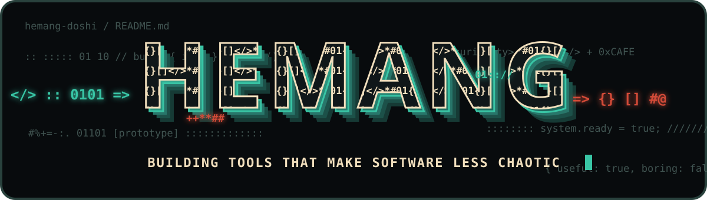

I'm a CS graduate by credential, but a builder by default.

I'm the kind of programmer who notices a repeated annoyance, opens a new repository, and accidentally turns the fix into a real product. I care about software being useful, understandable, and pleasant to use—not merely technically correct. That usually puts me somewhere between **product thinking, systems engineering, and “wait, I can automate this.”**

Most days, I'm moving between a terminal, a browser, and some suspiciously unnecessary hardware. I like clean interfaces, explicit systems, measurable claims, honest documentation, and projects with just enough personality to feel human.

Current rabbit holes:

- agent infrastructure that saves context instead of eating it
- local-first software with boring, reliable internals
- APIs that connect AI to useful, real-world data
- tiny hardware side quests that absolutely could have stayed software

> Curious enough to prototype it. Stubborn enough to make it reliable.

<p align="center">
  <a href="https://hemang-portfolio-zeta.vercel.app/"><strong>portfolio ↗</strong></a>
  &nbsp;·&nbsp;
  <a href="https://github.com/hemang-doshi?tab=repositories">projects</a>
  &nbsp;&nbsp;&nbsp;
  <a href="https://www.linkedin.com/in/hemang-doshi-236aa6244/"></a>
  &nbsp;&nbsp;
  <a href="https://www.instagram.com/hemang._26/"></a>
</p>

My portfolio is the fuller story: interactive project demos, creator experiments, and the rabbit holes behind the repositories. **[Step inside the goofy internet machine →](https://hemang-portfolio-zeta.vercel.app/)**

<sub><i>Me, looking down at the bug that “cannot possibly happen in production.”</i></sub>

<br clear="right" />

## Things I've shipped

| Project | What it does | Built with |
|---|---|---|
| [**DevDeck**](https://github.com/hemang-doshi/dev-deck) | A local runtime control plane that lets humans and AI coding agents manage multi-service development stacks without drowning in terminal output. | TypeScript · Node.js · CLI |
| [**Agent Memory**](https://github.com/hemang-doshi/agent-memory) | Local-first, auditable project memory for coding agents—with hybrid retrieval, safety gates, MCP, adapters, and SQLite storage. | TypeScript · SQLite · MCP |
| [**Instagram Creator Intelligence API**](https://github.com/hemang-doshi/instagram-creator-intelligence-api) | A production-ready, read-only Instagram analytics backend built for Custom GPT Actions. | Next.js · TypeScript · Meta Graph API |
| [**AuxDeck**](https://github.com/hemang-doshi/aux-deck) | A tiny ESP32 sidecar that shows live Spotify artwork, metadata, progress, and waveform data from a Mac. | ESP32 · Python · C++ · BLE |

## The toolbox

```text
languages     TypeScript · JavaScript · Python · C/C++ · SQL
building      Next.js · Node.js · React · REST APIs · CLIs
agent stuff   MCP · tool design · evals · retrieval · local-first memory
systems       SQLite · ESP32 · BLE · Wi-Fi · GitHub Actions · Vercel
```

## The build philosophy

```text
useful > impressive
working > almost perfect
measured > vibes
local-first whenever it makes sense
```

## A highly scientific development timeline

<p align="center">
  <a href="https://giphy.com/gifs/viralhog-viral-hog-kitten-fascinated-by-the-text-its-typing-gwjociZExlDqAJWXgO"></a>
  &nbsp;&nbsp;
  <a href="https://giphy.com/gifs/sydneysprague-computer-oldcomputer-terribleplaces-B3boElCzs5vpSHyfQU"></a>
</p>

<p align="center"><sub>staff engineers reviewing my pull request</sub></p>

Still curious. Still shipping. Probably turning one more minor inconvenience into a repository.
